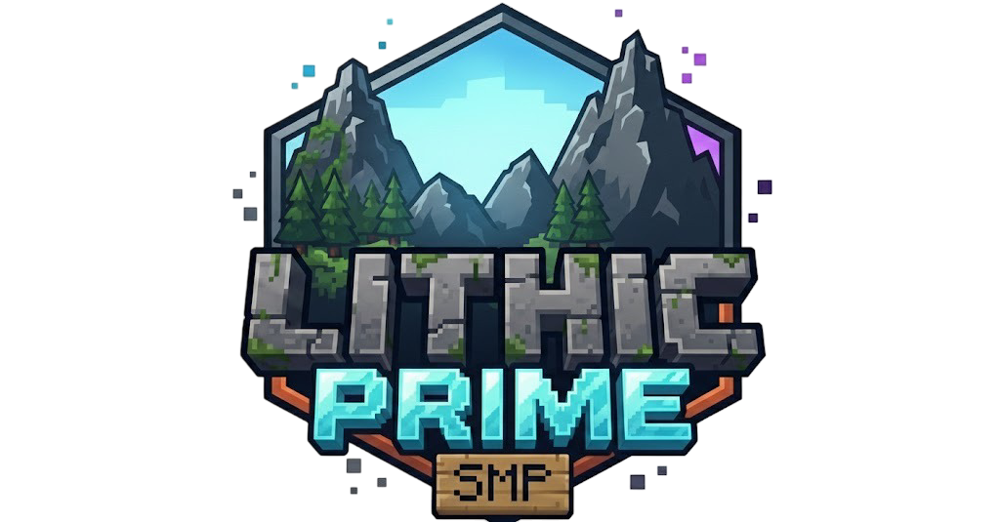

<div align="center">



# 🌸 Lithic Prime SMP

**A Vanilla+ Minecraft Experience with 274 Carefully Selected Mods**

[](https://llunarstack.github.io/Lithic_Prime_SMP/)
[](https://www.minecraft.net/)
[](https://fabricmc.net/)
[](LICENSE)

*Forge your legacy in a world transformed*

[🎮 Join Server](#-join-the-server) • [📦 Download Mods](#-download-modpack) • [📖 Documentation](#-features) • [🤝 Contributing](#-contributing)

</div>

---

## ✨ About

**Lithic Prime SMP** is a community-focused Minecraft server featuring a carefully curated modpack that enhances vanilla gameplay without overwhelming it. Our modpack includes:

- 🏔️ **Epic Terrain Generation** - Explore breathtaking biomes with Terralith, Tectonic, and more
- 🔮 **Powerful Magic Systems** - Master arcane enchantments and mystical abilities
- ⚙️ **Advanced Technology** - Build massive factories with Create and other tech mods
- 🏗️ **Endless Building Possibilities** - Thousands of decorative blocks and furniture options
- ⚔️ **Thrilling Dungeons** - Discover new structures and challenges

### 📊 Modpack Stats

- **245 Mandatory Mods** - Core gameplay enhancements
- **29 Optional Mods** - Performance and visual improvements
- **Minecraft Version:** 1.21.11
- **Loader:** Fabric

---

## 🎮 Join the Server

### Server Address
```
play.lithicprime.com
```

### How to Join

1. **Apply for Whitelist** - Visit our [website](https://llunarstack.github.io/Lithic_Prime_SMP/) and fill out the application
2. **Download the Modpack** - Get the mandatory mods (optional mods recommended)
3. **Install Fabric Loader** - Version 1.21.11
4. **Connect & Play!**

### Server Rules

- ✅ Be respectful and kind to all players
- ✅ No griefing or stealing
- ✅ PvP only with consent
- ✅ Keep the world beautiful - clean up after yourself
- ❌ No hacked clients or exploits

---

## 📦 Download Modpack

Choose your preferred download option:

| Pack Type | Mods | Size | Download |
|-----------|------|------|----------|
| **Full Pack** | 274 mods | ~555 MB | [Download](https://mega.nz/file/vBVzHYZS#MuUzhn55dI9PBjOTfaKSmVH699TkhSLDL8ljlBhZwyU) |
| **Mandatory** | 245 mods | ~503 MB | [Download](https://mega.nz/file/DcVzgCqR#cZ36tTnfJDxupHOjb6Mq5pxbiCRHArGhVZ_twh8pObY) |
| **Optional** | 29 mods | ~26 MB | [Download](https://mega.nz/file/7d0iXSwC#2HioNptZgWJoqAdGO3V616vWkNmLExPsPqeYSFiWo9Q) |

### Installation

1. Download and install [Fabric Loader](https://fabricmc.net/use/) for Minecraft 1.21.11
2. Download your preferred modpack from the links above
3. Extract the `.zip` file to your `.minecraft/mods` folder
4. Launch Minecraft with the Fabric profile
5. Connect to `play.lithicprime.com`

---

## 🌟 Features

### 🎨 Website Features

- **Interactive Mod Browser** - Search and filter through all 274 mods
- **AI-Powered Whitelist** - Automated application review system
- **Responsive Design** - Beautiful pixel-art themed UI
- **Download Manager** - Easy access to all modpack versions
- **Server Rules** - Clear guidelines for community members

### 🎮 Gameplay Features

- **World Generation** - Terralith, Tectonic, Incendium, Nullscape
- **Building & Decoration** - Macaw's mods, Handcrafted, Rechiseled
- **Technology** - Create, Energized Power, Tom's Storage
- **Magic & Combat** - Elemental Swords, Universal Enchants, Stellarity
- **Quality of Life** - JEI, JourneyMap, Jade, Shulker Box Tooltip
- **Performance** - Sodium, Lithium, FerriteCore

---

## 🛠️ Development

This website is built with modern web technologies:

- **React** + **TypeScript** - Type-safe component architecture
- **Vite** - Lightning-fast build tool
- **Tailwind CSS** - Utility-first styling
- **Google Gemini AI** - Intelligent whitelist system
- **Lucide Icons** - Beautiful icon library

### Run Locally

**Prerequisites:** Node.js 18+

```bash
# Clone the repository
git clone https://github.com/Llunarstack/Lithic_Prime_SMP.git
cd Lithic_Prime_SMP

# Install dependencies
npm install

# Set up environment variables
# Create .env.local and add your Gemini API key:
# VITE_GEMINI_API_KEY=your_api_key_here

# Start development server
npm run dev
```

### Build for Production

```bash
npm run build
npm run preview
```

---

## 🤝 Contributing

We welcome contributions! Here's how you can help:

1. **Report Bugs** - Open an issue with details
2. **Suggest Features** - Share your ideas
3. **Submit PRs** - Improve the website or documentation
4. **Join the Community** - Play on the server and provide feedback

### Development Guidelines

- Follow the existing code style
- Test your changes thoroughly
- Update documentation as needed
- Keep commits focused and descriptive

---

## 📝 License

This project is licensed under the MIT License - see the [LICENSE](LICENSE) file for details.

---

## 🙏 Acknowledgments

- **Mod Creators** - Thank you to all the talented developers who created the mods in our pack
- **Fabric Team** - For the amazing mod loader
- **Community** - Our amazing players who make Lithic Prime special
- **Contributors** - Everyone who has helped improve this project

---

## 📞 Contact & Links

- 🌐 **Website:** [lithicprime.com](https://llunarstack.github.io/Lithic_Prime_SMP/)
- 🎮 **Server:** `play.lithicprime.com`
- 💬 **Discord:** [Join our community](#) *(coming soon)*

---

<div align="center">

**Made with ❤️ by the Lithic Prime Team**

⭐ Star this repo if you enjoy our server!

</div>
